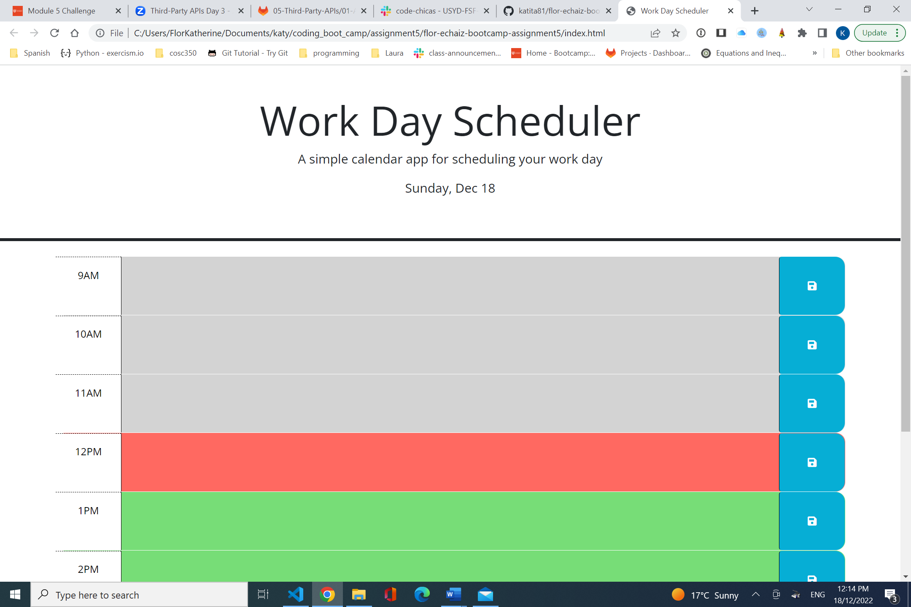
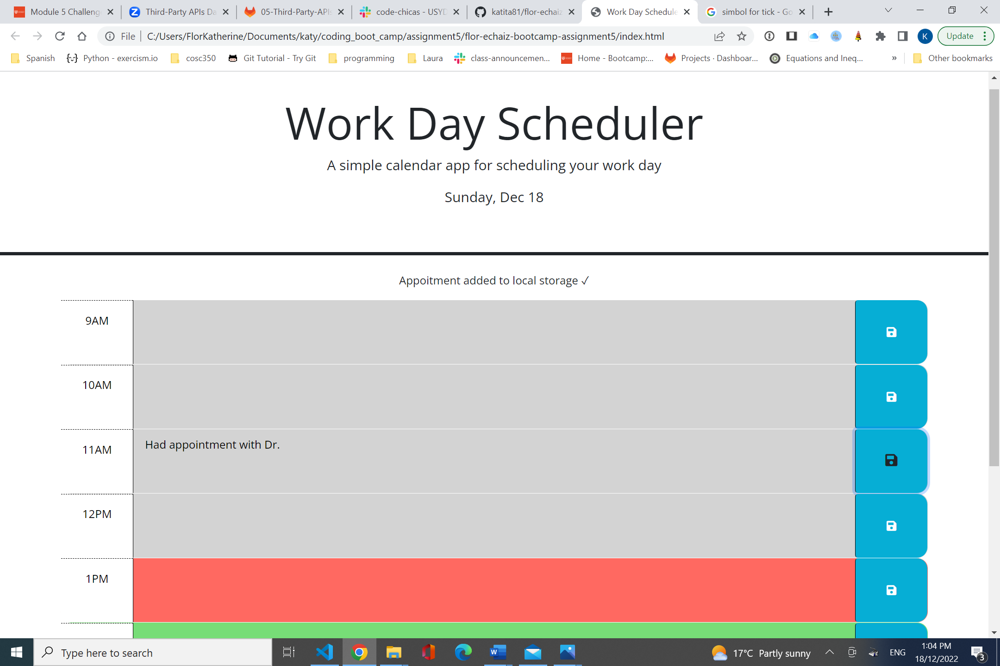
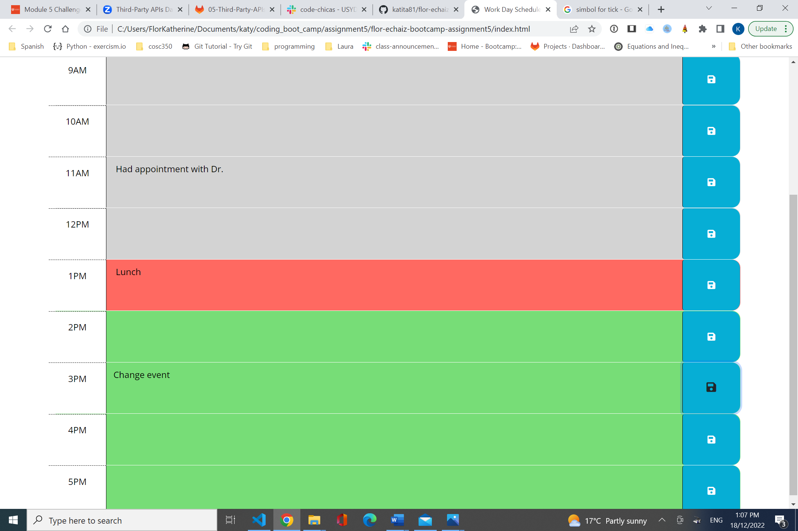

# Workday Scheduler

The Work Day Schedular displays a web page with the current date and slots with hours and input spaces
next to the times, to add the tasks or appoitnment for that day. It highlights the current time slot with
red color and the past slots with grey color as well as the future time slots with green color. The user can write 
the desired activity for the correspondent time of that particular day, or modify and save the entries in local storage. 
After this happens a message notifying of the appoitnment added in the local storage is displayed. When the user close 
the web page or refresh it, the saved task are shown.

Highlight current, past, and future times.

Saves appointment, displaying notification of that.

Saves more appoitments.

Changes existing appoitment and saves it. 

